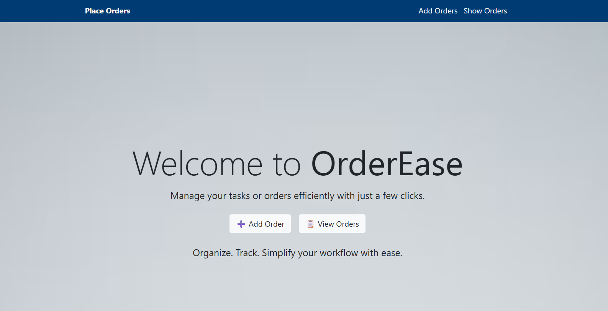
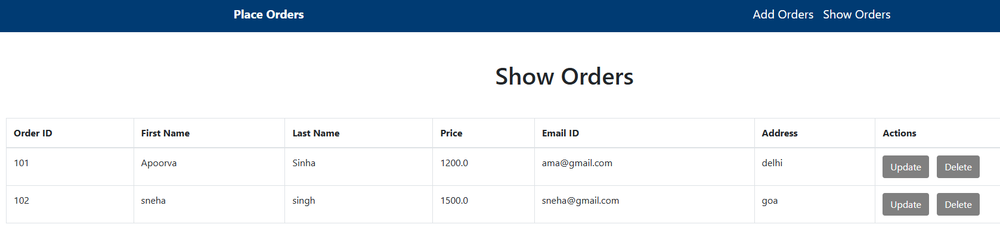
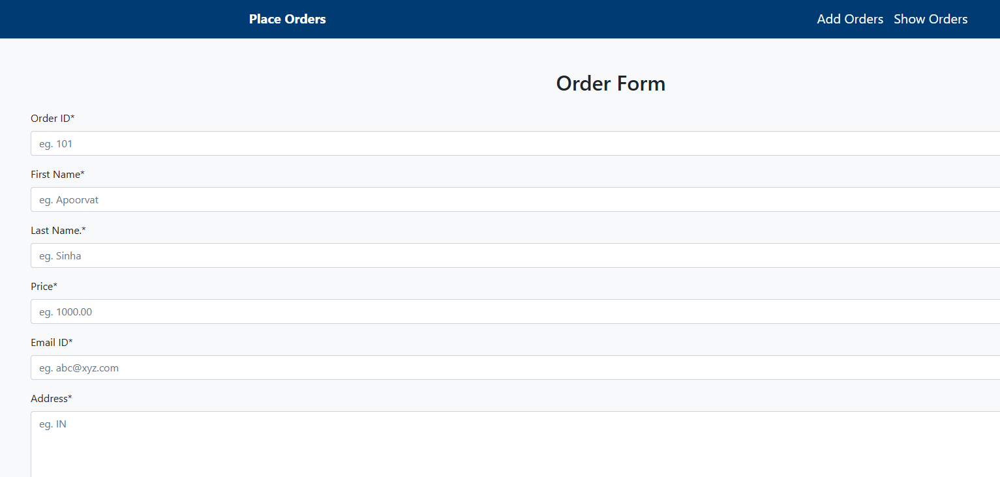

# OrderEase 🛒

OrderEase is a Django-based web application for managing and tracking customer orders. It includes an admin panel for managing the system, adding/modifying/deleting orders, and monitoring order status with ease.

---

## ✨ Features

- Place and manage customer orders
- Track order status
- Admin panel for full backend control
- Built using Django (Python)
- Simple UI for usability

---

## 🛠️ Tech Stack

- **Backend:** Django (Python)
- **Database:** SQLite 
- **Frontend:** HTML, CSS 

---

## 🚀 Getting Started

### 1. Clone the Repository

```bash
git clone https://github.com/Apoorva-Sinhaa/OrderEase.git
cd orderease
```

### 2. (Optional) Create and Activate a Virtual Environment

```bash
# Create virtual environment
python -m venv venv

# Activate (Windows)
venv\Scripts\activate

# Activate (Mac/Linux)
source venv/bin/activate
```

### 3. Install Dependencies

```bash
pip install -r requirements.txt
```

> If you don’t have a `requirements.txt` yet, you can create one by running:
```bash
pip freeze > requirements.txt
```

---

### 4. Make Migrations and Migrate Database

```bash
python manage.py makemigrations
python manage.py migrate
```

---

### 5. Create Superuser for Admin Panel

```bash
python manage.py createsuperuser
```

> Follow the prompts to set username, email, and password.

---

### 6. Run the Development Server

```bash
python manage.py runserver
```

Visit `http://127.0.0.1:8000/` in your browser.

Admin panel: `http://127.0.0.1:8000/admin/`

---


---

## 📸 Screenshots


### 🖼️ Home Page


### 📋 Order List


### 🔐 Addng Orders


---

## 📄 License

MIT License

---

## 🙌 Contributions

Feel free to fork the repo and submit pull requests!
